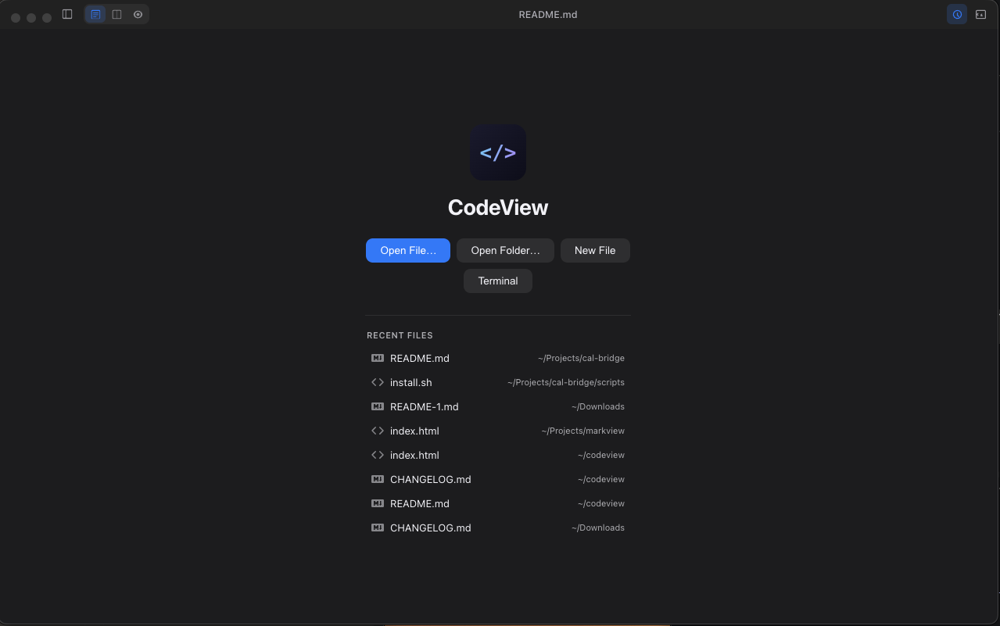
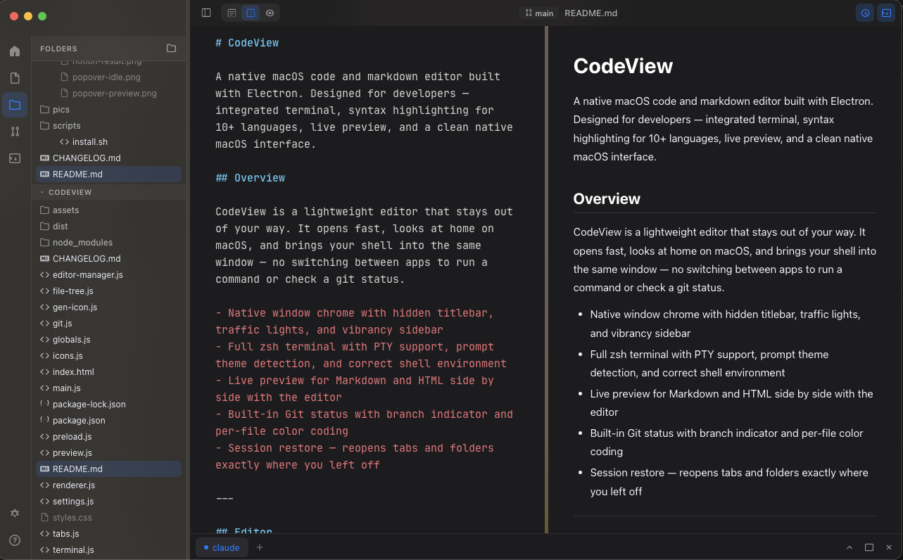
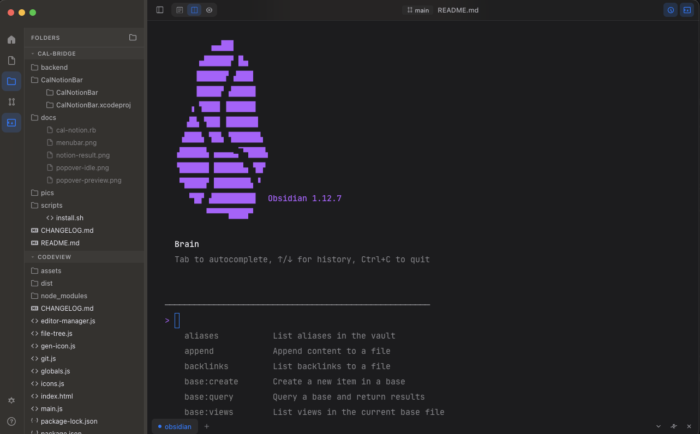
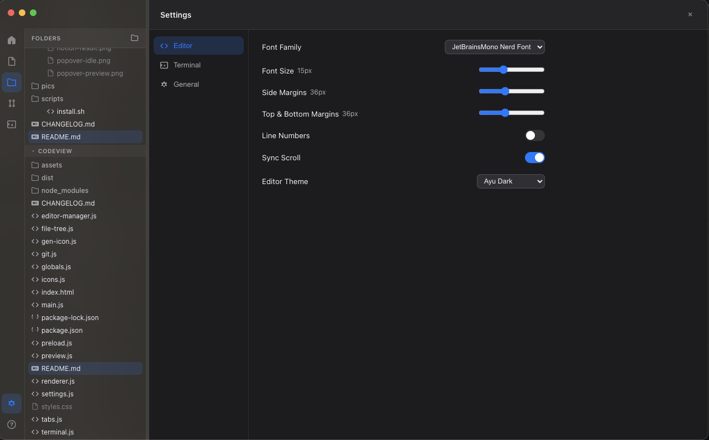

# CodeView

A native macOS code and markdown editor built with Electron. Designed for developers — integrated terminal, syntax highlighting for 10+ languages, live preview, and a clean native macOS interface.

## Screenshots

| Splash Screen | Editor & Preview |
|:---:|:---:|
|  |  |

| Terminal | Settings |
|:---:|:---:|
|  |  |

---

## Overview

CodeView is a lightweight editor that stays out of your way. It opens fast, looks at home on macOS, and brings your shell into the same window — no switching between apps to run a command or check a git status.

- Native window chrome with hidden titlebar, traffic lights, and vibrancy sidebar
- Full zsh terminal with PTY support, prompt theme detection, and correct shell environment
- Live preview for Markdown and HTML side by side with the editor
- Built-in Git status with branch indicator and per-file color coding
- Session restore — reopens tabs and folders exactly where you left off

---

## Editor

CodeMirror 5 powers the editor with syntax highlighting across 10+ file types. Line numbers, active-line highlight, bracket matching, and auto-close brackets are on by default.

**View Modes** — switch between editor-only, split, and preview-only with `Cmd+1 / 2 / 3`. In split mode, scrolling can be synchronized between the editor and preview panes.

**Table of Contents** — collapsible outline panel on the right side; click any heading to jump to it; scroll spy tracks the active section as you move through the preview. Toggle with `Cmd+Shift+T`.

**Syntax-Highlighted Code Blocks** — fenced code blocks in the markdown preview render with full syntax coloring via highlight.js. Language is auto-detected when not specified; colors use the app's theme palette.

**Slash Commands** — type `/` at the start of a blank line to open a searchable command menu. Choose from 17 block types including headings, lists, code blocks, Mermaid diagrams, tables, links, and more. Filter by typing, navigate with arrow keys, confirm with Enter.

**Right-Click Context Menu** — right-click anywhere in the editor to access formatting actions. Wraps selected text or inserts at cursor: bold, italic, strikethrough, inline code, link, image, headings, code block, Mermaid, and quote.

**Mermaid Diagrams** — fenced ` ```mermaid ``` ` blocks render as live diagrams in the preview panel, automatically matching the active light or dark theme.

**Supported File Types**

| Extension | Mode |
|-----------|------|
| `.md`, `.markdown` | Markdown — rendered preview with full GFM support |
| `.html`, `.htm` | HTML — live rendered preview via blob URL |
| `.json` | JSON — formatted preview |
| `.js`, `.mjs`, `.cjs` | JavaScript |
| `.ts`, `.tsx` | TypeScript |
| `.py` | Python |
| `.yaml`, `.yml` | YAML |
| `.sh`, `.bash`, `.zsh` | Shell scripts |
| `.txt` | Plain text |

---

## Terminal

A full PTY-backed zsh terminal lives inside the window with flexible split layouts. It sources your `.zshrc` on startup, so prompt themes like Oh My Zsh, Starship, and Powerlevel10k work out of the box.

- **Horizontal split** — toolbar button opens the terminal at the bottom below the editor/preview; click again to close
- **Vertical split** — toolbar button docks the terminal on the right side of the window with content on the left; when in this mode, editor/preview stack vertically so nothing feels cramped
- **Independent axes** — content view mode (editor/split/preview) and terminal position (bottom/right) are fully independent; switch between them freely
- **Shell environment** — resolves your full login-shell environment at launch so PATH, NVM, pyenv, and other tool shims are available immediately
- **Multiple sessions** — tabbed interface with per-session current-directory labels
- **Maximize / Collapse / Restore** — full-panel mode with a dedicated button; collapses to just the tab bar without killing the session
- **Resizable** — drag the divider to adjust terminal size in either layout direction
- **Customizable** — independent font, size, padding, line height, letter spacing, cursor style, and ANSI color palette

**Terminal Color Palettes:** Apple Dark, Kaku, Dracula, Nord, Solarized Dark, One Dark

---

## Git Integration

- **Branch indicator** — current branch name shown in the center of the toolbar
- **File status** — modified files show an orange **M**, untracked files show a green **??** in the sidebar tree
- **Auto-refresh** — status updates when the window regains focus

---

## Sidebar & Navigation

The **activity bar** on the left gives quick access to every view:

| Icon | Panel |
|------|-------|
| Home | Open files and folders at a glance, click to jump |
| Files | Open file tabs |
| Folders | Multi-folder file tree |
| Git | Git status view |
| Terminal | Jump to terminal |
| `?` | Keyboard shortcut reference |
| Settings | Open preferences |

The sidebar can be collapsed with `Cmd+B` or the toolbar toggle. Multiple folders open as independently collapsible sections in the file tree.

---

## Settings

Open with `Cmd+,` or via the settings icon. Press `Escape` or click outside to close.

### Editor
- Font family (JetBrains Mono, Fira Code, SF Mono, Menlo, and Nerd Font variants)
- Font size (10–24px)
- Side and vertical margins
- Line numbers toggle
- Synchronized scrolling toggle

### Terminal
- Font family and size (independent from editor)
- Padding, line height, letter spacing
- Cursor style — block, underline, or bar
- ANSI color palette

### General
- Theme — System (auto), Light, or Dark
- Session restore — reopen tabs and folders on launch
- Check for Updates

---

## Installation

### Homebrew (recommended)

```bash
brew tap dkeg/codeview
brew install --cask codeview
```

### From Source

```bash
git clone https://github.com/dkeg/codeview.git
cd codeview
npm install
npm run rebuild
npm start
```

### Build as macOS App

```bash
npm run build
```

The built `.app` will be in `dist/mac-arm64/` (Apple Silicon) or `dist/mac/` (Intel).

---

## Keyboard Shortcuts

| Shortcut | Action |
|----------|--------|
| `Cmd+N` | New file |
| `Cmd+O` | Open file |
| `Cmd+Shift+O` | Open folder |
| `Cmd+S` | Save |
| `Cmd+Shift+S` | Save as |
| `Cmd+W` | Close tab |
| `Cmd+1` | Editor only |
| `Cmd+2` | Split view |
| `Cmd+3` | Preview only |
| `Cmd+Shift+P` | Cycle view modes |
| `Cmd+B` | Toggle sidebar |
| `Cmd+Shift+T` | Toggle table of contents |
| `` Cmd+` `` | Toggle terminal |
| `Cmd+,` | Toggle settings |
| `Escape` | Close settings or help |

---

## Tech Stack

- [Electron](https://www.electronjs.org/) — desktop app framework
- [CodeMirror 5](https://codemirror.net/5/) — syntax-highlighted editor
- [xterm.js](https://xtermjs.org/) — terminal emulator
- [node-pty](https://github.com/microsoft/node-pty) — native PTY bindings
- [marked](https://marked.js.org/) — Markdown parser and renderer
- [highlight.js](https://highlightjs.org/) — Syntax highlighting for code blocks in preview
- [Mermaid](https://mermaid.js.org/) — Diagram and chart rendering

---

## License

MIT
